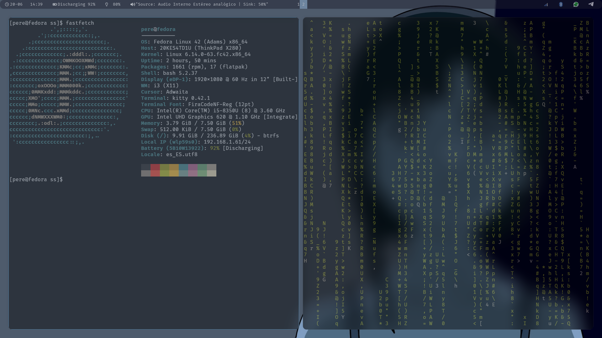

    i3wm — gestor de ventanas dinámico.

    polybar — barra de estado y sistema para i3.

    kitty — emulador de terminal rápido y con soporte para ligaduras e imágenes.

    picom — compositor de ventanas para efectos como transparencias y sombras.

    lightdm — gestor de inicio de sesión (display manager).

    blueman-applet — applet de bandeja para gestión de dispositivos Bluetooth.

    pavucontrol — interfaz gráfica para gestionar PipeWire/PulseAudio.

    pipewire — servidor de audio y multimedia.

    fastfetch — herramienta para mostrar información del sistema en terminal.

    FontAwesome 4 — conjunto de iconos utilizado en Polybar.

    Noto Sans Mono / Noto Sans Mono Regular — fuente monoespaciada para terminal y barra.

Capturas 

   
